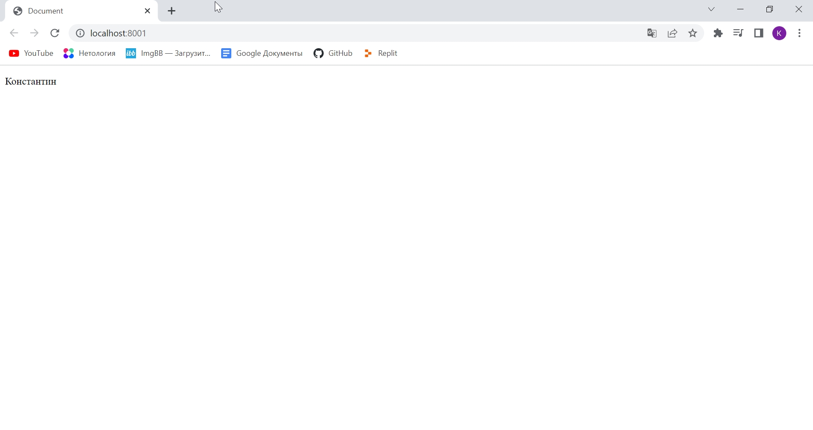

## Тестовые задания для вакансии Тестировщик в Анлим-Софт

1. Ссылка на файл [test.txt](https://github.com/konstantinDukov423/qa/blob/Konstantin/test.txt)
2. [dockerfile](/dockerfile) и [index.html](/index.html) А так же скриншот :  
3. [Тест кейс](https://docs.google.com/spreadsheets/d/1i2UFbInMHhJ6yi_IfTeweWLtc8ra95ZOU0CjXsVm4lA/edit#gid=0) на задание номер 2.
4. [Скриншоты и описание](https://docs.google.com/document/d/1TEszIc9j_Y6nISofviLQ1bbaX0tz94fe3Ci4rJ0G1k4/edit) к запросам и ответам.
5. [Тесты](https://docs.google.com/document/d/1qRJA-TsXJ2O0OGXKTwbz-2ig-qhkpczQzNDeMdC1Z84/edit) для напольных весов
